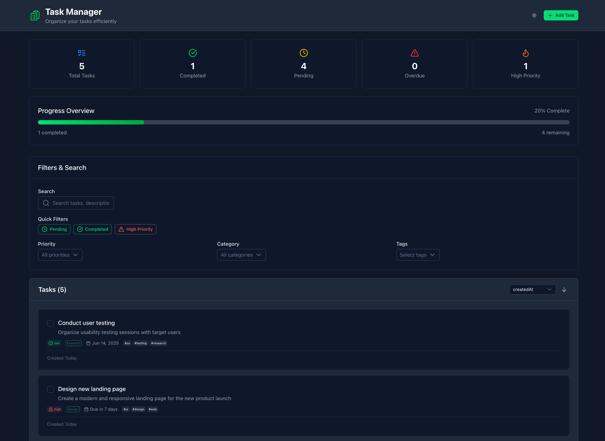

# Nuxt Task Manager

A modern, feature-rich task management application built with Nuxt 3, Vue 3, and TypeScript. This application provides a comprehensive solution for managing tasks with advanced filtering, sorting, and state management capabilities.

## 🚀 Live Demo

**[View Live Application](https://nudg.netlify.app)** - Experience the app in action!



## ✨ Features

### Core Functionality
- **Task Management**: Create, read, update, and delete tasks
- **Task Completion**: Toggle task completion status with visual indicators
- **Task Duplication**: Quickly duplicate existing tasks
- **Bulk Operations**: Clear all completed tasks

### Advanced Features
- **Smart Filtering**: Filter by completion status, priority, category, and tags
- **Quick Filters**: One-click filters for pending, completed, and high-priority tasks
- **Search**: Full-text search across task titles, descriptions, and tags
- **Sorting**: Sort by creation date, due date, priority, or title (ascending/descending)
- **Statistics Dashboard**: Real-time stats showing total, completed, pending, overdue, and high-priority tasks

### User Experience
- **Responsive Design**: Optimized for desktop, tablet, and mobile devices
- **Dark Mode Support**: Built-in dark/light theme switching
- **Accessibility**: ARIA-compliant components with keyboard navigation
- **Real-time Updates**: Instant UI updates with optimistic rendering
- **Local Storage**: Automatic persistence without backend dependency

### Data Management
- **Type Safety**: Complete TypeScript integration with Zod validation
- **State Management**: Pinia store for centralized state management
- **Form Validation**: Real-time form validation with error handling
- **Data Persistence**: Automatic save/restore from browser localStorage

## 🛠️ Tech Stack

### Frontend Framework
- **[Nuxt 3](https://nuxt.com/)** - The Intuitive Vue Framework
- **[Vue 3](https://vuejs.org/)** - The Progressive JavaScript Framework
- **[TypeScript](https://www.typescriptlang.org/)** - Type-safe JavaScript

### UI & Styling
- **[Nuxt UI v3](https://ui3.nuxt.dev/)** - Beautiful & Accessible UI Components
- **[Tailwind CSS v4](https://tailwindcss.com/)** - Utility-first CSS framework
- **[Lucide Icons](https://lucide.dev/)** - Beautiful & consistent icons
- **[Nuxt Fonts](https://fonts.nuxt.com/)** - Web font optimization

### State Management & Validation
- **[Pinia](https://pinia.vuejs.org/)** - The Vue Store
- **[Zod](https://zod.dev/)** - TypeScript-first schema validation

### Development Tools
- **[ESLint](https://eslint.org/)** - Code linting and formatting
- **[Vue TSC](https://github.com/vuejs/language-tools)** - Vue TypeScript compiler
- **[Nuxt DevTools](https://devtools.nuxt.com/)** - Development experience

## 🚀 Getting Started

### Prerequisites
- **Node.js**: Version 18.x or higher
- **Package Manager**: pnpm (recommended), npm, or yarn

### Installation

1. **Clone the repository**
   ```bash
   git clone <repository-url>
   cd nuxt-task-manager
   ```

2. **Install dependencies**
   ```bash
   # Using pnpm (recommended)
   pnpm install
   
   # Using npm
   npm install
   
   # Using yarn
   yarn install
   ```

### Development

Start the development server:

```bash
# Using pnpm
pnpm dev

# Using npm
npm run dev

# Using yarn
yarn dev
```

The application will be available at `http://localhost:3000`

### Production Build

Build the application for production:

```bash
# Using pnpm
pnpm build

# Using npm
npm run build

# Using yarn
yarn build
```

Preview the production build locally:

```bash
# Using pnpm
pnpm preview

# Using npm
npm run preview

# Using yarn
yarn preview
```

## 📁 Project Structure

```
nuxt-task-manager/
├── components/              # Vue components
│   ├── TaskCard.vue        # Individual task display component
│   ├── TaskFilters.vue     # Filtering and search component
│   ├── TaskForm.vue        # Task creation/editing form
│   ├── TaskStats.vue       # Statistics dashboard
│   └── WelcomeCard.vue     # Welcome message component
├── pages/                   # Nuxt pages (file-based routing)
│   └── index.vue           # Main application page
├── stores/                  # Pinia stores
│   └── tasks.ts            # Task management store
├── types/                   # TypeScript type definitions
│   ├── task.ts             # Task-related types and schemas
│   └── vue-macros.d.ts     # Vue macro type definitions
├── utils/                   # Utility functions
│   ├── date.ts             # Date formatting utilities
│   └── priority.ts         # Priority-related utilities
├── assets/                  # Static assets
│   └── css/
│       └── main.css        # Global styles
├── public/                  # Public static files
├── app.vue                  # Root Vue component
├── nuxt.config.ts          # Nuxt configuration
├── tailwind.config.js      # Tailwind CSS configuration
├── tsconfig.json           # TypeScript configuration
└── package.json            # Project dependencies and scripts
```

## 🎯 Key Components

### TaskCard Component
- **Purpose**: Displays individual tasks with all metadata
- **Features**: Priority indicators, completion toggles, action menus
- **Props**: Task object
- **Events**: Edit, delete, duplicate, toggle completion

### TaskForm Component
- **Purpose**: Handles task creation and editing
- **Features**: Form validation, modal integration, date/time picker
- **Validation**: Zod schema-based validation with error handling
- **Props**: Edit mode, initial data, modal context

### TaskFilters Component
- **Purpose**: Provides filtering and search capabilities
- **Features**: Quick filters, dropdown filters, search input
- **State**: Reactive filter state with debounced search
- **Events**: Filter updates with proper state management

### TaskStats Component
- **Purpose**: Displays real-time task statistics
- **Features**: Total, completed, pending, overdue, high-priority counts
- **Styling**: Color-coded cards with icons

## 🔧 Configuration

### Environment Variables
No environment variables are required for basic operation. The application uses browser localStorage for data persistence.

### Customization
- **Colors**: Modify the color scheme in `tailwind.config.js`
- **Icons**: Change icons in the component files (using Lucide icons)
- **Task Properties**: Extend task schema in `types/task.ts`
- **Validation**: Update Zod schemas for custom validation rules

## 📝 Usage Examples

### Creating a Task
1. Click the "Add New Task" button
2. Fill in the required fields (title, category)
3. Optionally set priority, due date, and tags
4. Click "Create Task"

### Filtering Tasks
- Use quick filter buttons for common filters
- Use dropdown menus for specific priority/category filtering
- Use the search bar for text-based filtering
- Combine multiple filters for precise results

### Managing Tasks
- Click the checkbox to toggle completion
- Use the three-dot menu for edit/duplicate/delete actions
- View task statistics in the dashboard cards

## 🤝 Contributing

1. Fork the repository
2. Create a feature branch (`git checkout -b feature/amazing-feature`)
3. Commit your changes (`git commit -m 'Add some amazing feature'`)
4. Push to the branch (`git push origin feature/amazing-feature`)
5. Open a Pull Request

### Development Guidelines
- Follow TypeScript best practices
- Use Zod for all data validation
- Maintain component props/events interfaces
- Write meaningful commit messages
- Test thoroughly across device sizes

## 📄 License

This project is licensed under the MIT License - see the [LICENSE](LICENSE) file for details.

## 🙏 Acknowledgments

- [Nuxt.js](https://nuxt.com/) team for the amazing framework
- [Nuxt UI](https://ui3.nuxt.dev/) for the beautiful component library
- [Tailwind CSS](https://tailwindcss.com/) for the utility-first CSS framework
- [Lucide](https://lucide.dev/) for the icon library

## 📞 Support

If you encounter any issues or have questions:
1. Check the [Nuxt documentation](https://nuxt.com/docs)
2. Review the [Nuxt UI documentation](https://ui3.nuxt.dev/)
3. Open an issue in this repository

---

**Happy Task Managing! 🎉**
